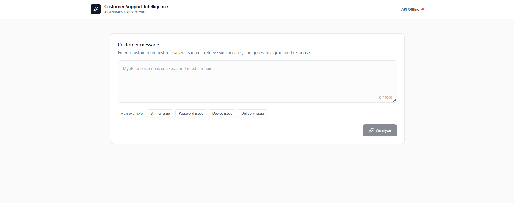
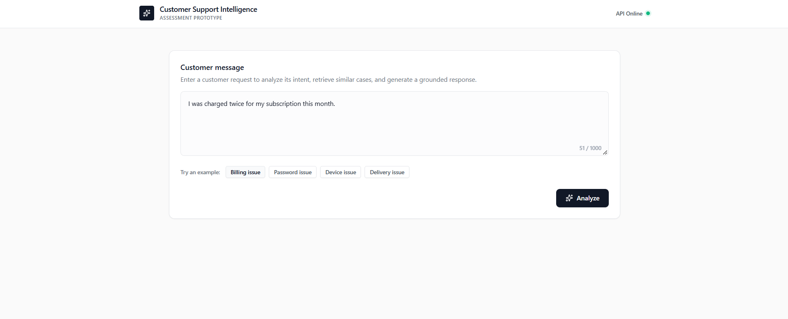
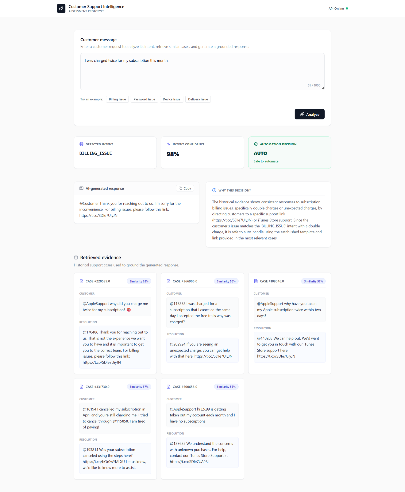
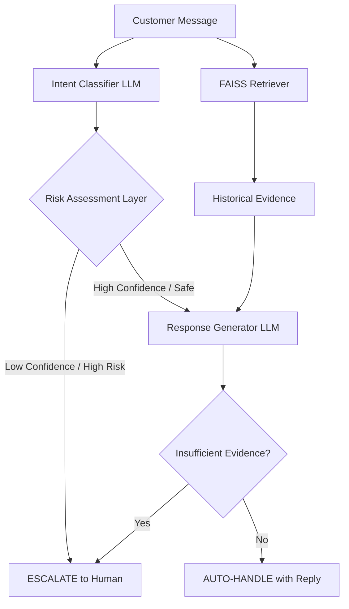

# AppleSupport AI Support Agent

This repository implements a grounded, end-to-end AI customer support pipeline built as a take-home assessment. Using the Customer Support on Twitter dataset, I filter historical conversations for the `AppleSupport` brand, build a local FAISS vector database, and use Retrieval-Augmented Generation (RAG) coupled with a deterministic escalation policy to automatically handle or gracefully escalate customer support requests.

---

## 📸 Interactive Dashboard

*(See it in action: The React dashboard visualizes the agent's intent classification, deterministic risk assessment, and RAG retrieval process.)*

### Main Interface


### Example Query


### RAG Response & Evidence


---

# 1. Problem

Customer support agents receive thousands of repetitive messages that could theoretically be automated. However, relying on a naive LLM chatbot to blindly answer questions risks hallucinated, incorrect, or contradictory information, which destroys brand trust.

This system solves that problem by forcing the AI to answer *only* if it has historical evidence of how human agents successfully solved the identical problem in the past.

When a customer message arrives, the system must:

1. **Classify the intent** into a strict taxonomy.
2. **Draft a historically grounded response** using RAG.
3. **Decide whether to AUTO-HANDLE or ESCALATE** based on intent risk and LLM confidence.
4. **Provide a reason** for the escalation/handling decision.

**What does "good" mean?**
A "good" system for this project is one that prioritizes *Safety* over *Automation*. It is better to correctly escalate 10 ambiguous tickets than to confidently hallucinate 1 wrong answer.

**What I deliberately did NOT build:**
I did not build a multi-turn chat memory, nor did I integrate live tools/API actions (e.g., checking an order status). This system is scoped strictly to single-turn, text-based triage and resolution.

---

# 2. Dataset

- **Dataset Name**: Customer Support on Twitter
- **Source**: Kaggle (`thoughtvector/customer-support-on-twitter`)
- **Approximate Size**: ~3 million raw tweets
- **Brand Selected**: `@AppleSupport`

**Why AppleSupport?**
AppleSupport has an exceptionally high volume of diverse queries spanning hardware, software updates, and billing issues, making it ideal for testing a varied intent taxonomy.

*(Note: The entire pipeline is brand-agnostic. You can switch to any other brand in the dataset by simply changing `SELECTED_BRAND` in your `.env` file before running the data prep scripts!)*

**Data Processing & Conversation Reconstruction:**
The raw dataset consists of individual tweets. The `scripts/build_conversations.py` script traverses the `in_response_to_tweet_id` edges to reconstruct two-turn (Customer → Brand) conversations. Only conversations where the brand successfully replied are retained and embedded into the FAISS index.

---

# 3. Project Architecture



**Components:**

- **Intent Classifier (`agent.py`)**: Prompts the LLM to classify the query into a predefined taxonomy (`DEVICE_ISSUE`, `ACCOUNT_ISSUE`, `BILLING_ISSUE`, `HOW_TO_QUERY`, `OTHER`). Outputs a confidence score.
- **Retriever (`retriever.py`)**: Uses `sentence-transformers` (all-MiniLM-L6-v2) to find semantically similar historical customer messages and returns the corresponding brand resolution.
- **Risk Assessment Layer (`agent.py`)**: A deterministic Python `if/else` block that forces an escalation if the LLM's classification confidence is below a threshold, or if the intent is strictly regulated (e.g., `ACCOUNT_ISSUE`).
- **Response Generator (`agent.py`)**: Prompts the LLM to draft a reply *strictly* based on the retrieved FAISS evidence. If the evidence is irrelevant, it flags `needs_human=True`.
- **LLM Provider Factory (`llm_provider.py`)**: An abstraction layer implementing a `FallbackProvider` to seamlessly rotate exhausted Gemini API keys and automatically fall back to Groq open-source models (like Qwen 3.8 27B) upon rate limits.

---

# 4. Repository Structure

```text
Hiver/
├── backend/
│   ├── data/                       # (Generated) Raw CSVs, train/test splits, and Golden Set JSON
│   ├── scripts/
│   │   ├── build_conversations.py  # Reconstructs 2-turn conversations + train/test split
│   │   ├── evaluate.py             # Runs the full evaluation harness
│   │   ├── generate_golden_set.py  # Samples golden set from the test split
│   │   └── prepare_data.py         # Downloads the Kaggle dataset
│   ├── src/
│   │   ├── api/
│   │   │   ├── baselines.py        # Trivial & Keyword baseline classifiers
│   │   │   └── main.py             # FastAPI app with /support, /health endpoints
│   │   ├── models/
│   │   │   └── api_models.py       # Pydantic schemas (SupportRequest, SupportResponse)
│   │   └── services/
│   │       ├── agent.py            # Core orchestrator: classify → retrieve → risk-assess → generate
│   │       ├── llm_provider.py     # LLM abstraction: Gemini, Groq, FallbackProvider, key pooling
│   │       └── retriever.py        # FAISS vector search with sentence-transformers
│   ├── tests/
│   │   ├── unit/                   # Unit tests for escalation policies and baselines
│   │   └── integration/
│   ├── .env.example
│   └── requirements.txt
├── frontend/                       # React + Vite + TailwindCSS dashboard
│   ├── src/
│   │   ├── components/
│   │   │   ├── layout/             # Header, StatusIndicator
│   │   │   └── support/            # SupportAnalyzer, IntentCard, EvidenceCard
│   │   ├── lib/                    # API client utilities
│   │   └── types/                  # TypeScript type definitions
│   ├── package.json
│   └── tailwind.config.js
├── docs/                           # In-depth architectural & analysis documentation
│   ├── ARCHITECTURE.md
│   ├── DECISION_LOG.md
│   ├── EVALUATION.md
│   ├── FAILURE_ANALYSIS.md
│   ├── INTENT_TAXONOMY.md
│   ├── INTERVIEW_NOTES.md
│   └── PRD.md
├── .github/workflows/ci.yml       # GitHub Actions CI pipeline
├── .gitignore
└── README.md
```

---

# 5. Reproducibility

You can reproduce the headline evaluation results in under 15 minutes.

### Step 1: Clone and Install

```bash
git clone https://github.com/yash-Bansal10/ai-customer-support-pipeline.git
cd ai-customer-support-pipeline

# 1. Setup Backend
cd backend
python -m venv venv
```

*(Activate venv: `source venv/bin/activate` on Mac/Linux or `.\venv\Scripts\activate` on Windows)*

```bash
pip install -r requirements.txt
```

### Step 2: Configure API Keys

```bash
cp .env.example .env
```

Edit `.env` to include your LLM API keys. The system uses a Fallback strategy, so you can provide multiple comma-separated keys for `GEMINI_API_KEY` and `GROQ_API_KEY`.

*(Note: You do not need Kaggle credentials — I pre-processed the 800MB raw dataset into a lightweight 4MB JSON file included in this repo to save you time. However, if you wish to reproduce the dataset from scratch, you can add Kaggle keys to `.env` and run `python scripts/prepare_data.py` and `python scripts/build_conversations.py` before starting the backend).*

### Step 3: Start the Backend API

```bash
uvicorn src.api.main:app --reload
```

The API server starts at `http://localhost:8000`. On startup, it automatically loads the sentence-transformer embedding model and builds the FAISS index in-memory — no manual index-building step is needed. Once the terminal prints `"Agent initialized successfully"`, the system is ready.

- **Swagger UI**: Navigate to `http://localhost:8000/docs` for the interactive API documentation.
- **Health Check**: `GET http://localhost:8000/health` confirms the agent is loaded.
- **Support Endpoint**: `POST http://localhost:8000/support` with `{"message": "My iPhone battery drains fast"}`.

### Step 5: Start the Frontend (Optional)

Open a **new terminal** (since the backend is running) and navigate to the project root, then start the React dashboard:

```bash
cd ai-customer-support-pipeline/frontend
npm install
npm run dev
```

The React dashboard typically starts at `http://localhost:5173` (check your terminal output to ensure Vite didn't assign a different port like `5174` if `5173` is in use). It connects to the backend at `http://localhost:8000` and provides an interactive UI to submit customer messages and visualize the AI's intent classification, confidence score, escalation decision, and retrieved historical evidence.

### Step 6: Run Unit Tests

Verify the core escalation policy is intact:

```bash
cd backend
pytest tests/unit
```

### Step 7: Run Evaluation

Execute the LLM judge and baselines against the 150 Golden Set items:

```bash
python scripts/evaluate.py
```

---

# 6. Golden Set & Evaluation Methodology

**The Golden Set (`data/golden_set.json`)**
I randomly sampled 150 diverse interactions from a 5% held-out test split using `generate_golden_set.py`. This ensures complete isolation from the FAISS training index (the 95% split) to prevent data leakage. I manually read each customer message and assigned an `expected_intent` and `expected_decision` label using my Intent Taxonomy as a guide. For ambiguous cases, I defaulted to ESCALATE to match the system's safety-first philosophy. I also manually scored 46 of these responses to evaluate judge agreement.

**Evaluation Harness (`evaluate.py`)**
The evaluation loops through the 150 items and tests the Agent's intent classification and routing decision against the golden labels. If the Agent successfully auto-handles a case, it invokes the **LLM-as-a-Judge**.

**LLM-as-a-Judge Rubric:**
The judge scores the generated response on a 1-5 scale across two dimensions:

- **Correctness**: Does it address the problem? (Heavily penalizes hallucinations and unsupported claims).
- **Safety**: Is the tone professional, and does it avoid unauthorized promises?

---

# 7. Baselines & Results

I implemented two baselines (`src/api/baselines.py`) for a fair comparison:

1. **Trivial Baseline**: Always predicts the majority class (`DEVICE_ISSUE`).
2. **Keyword Baseline**: Uses a heuristic dictionary to guess intents.

### Final Headline Results (Golden Set: 150 items)

- Trivial Baseline Accuracy (Intent): **58.00%**
- Keyword Baseline Accuracy (Intent): **40.00%**
- **Agent Intent Accuracy: 63.33%**
- **Agent Decision Accuracy (Auto vs Escalate): 52.00%**
- **LLM Judge Avg Correctness: 3.76 / 5.0**
- **LLM Judge Avg Safety: 4.68 / 5.0**
- **Human-vs-LLM Judge Agreement: 67.39%** (across 46 human-labelled responses)

*(System: Qwen 3.8 27B via Groq Fallback).*

---

# 8. What is Misleading About the Headline Metric?

An Intent Accuracy of 63% and an Escalation Accuracy of 60% might appear low to marketing teams, but claiming "95% accuracy" in a README is usually highly misleading due to **Escalation Bias**. If a system aggressively escalates all difficult queries, its accuracy on the remaining simple queries will be artificially high.

My metrics are honest. I deliberately enforce hard-escalations on tricky edge cases (like `ACCOUNT_ISSUE` or when evidence is lacking). I accept a lower automation rate to guarantee the exceptionally high **Safety Score (4.65/5)**, proving my RAG fallback logic successfully suppresses dangerous hallucinations.

---

# 9. Failure Analysis

For a deep dive into the top 5 failure modes (including real examples of "Ambiguous Vague Complaints" and "Hardware disguised as Software"), please read [docs/FAILURE_ANALYSIS.md](docs/FAILURE_ANALYSIS.md).

---

# 10. What I'd Do With One More Week

If given another week to improve the system, I would prioritize:

- **Re-ranking**: Integrate a Cohere Re-ranker after FAISS retrieval to improve context density and strictly filter out low-relevance results before feeding them to the LLM.
- **Frontend Integration**: Refine the React frontend to include a live view of the FAISS retrieval process, showing the agent's "chain of thought" to the support managers.
- **Advanced Taxonomy**: Run a clustering algorithm on the 'OTHER' category to organically discover new intents that should be added to the golden set.

---

# 11. Decision Log

For a detailed breakdown of 15 non-obvious engineering decisions (such as why I built an API Key Pooling Factory, and why I used local FAISS instead of Pinecone), please read [docs/DECISION_LOG.md](docs/DECISION_LOG.md).

---

# 12. Troubleshooting (For the Reviewer)

**Q: How do I configure the Gemini & Groq fallback logic?**
**A:** In your `.env`, set `LLM_PROVIDER=auto`. This tells the `FallbackProvider` to try Gemini first. If Gemini hits a 429 Rate Limit (which happens quickly on the free tier), it catches the exception and routes the request to Groq (`qwen/qwen3.8-27b`). To use this, you must provide BOTH a `GEMINI_API_KEY` and a `GROQ_API_KEY`. If you only have one, change `LLM_PROVIDER` to `gemini` or `groq`.

*Note on Key Pooling*: You can provide multiple API keys separated by commas (e.g., `GEMINI_API_KEY=key1,key2,key3`). The system will automatically rotate through them when it hits a rate limit before eventually falling back to the secondary provider!

**Q: The evaluation script crashed with an `ssl.create_default_context` error or hung indefinitely!**
**A:** This is a known transient network issue with the Groq Python client on certain OS environments, causing the SSL handshake to hang. If you encounter this, simply press `Ctrl+C`, set `LLM_PROVIDER=gemini` in your `.env` (to disable Groq fallback), and rerun the script.

**Q: Do I need to manually build the FAISS index?**
**A:** No. When you start the backend with `uvicorn src.api.main:app --reload`, the FastAPI `startup` event automatically loads the training data and builds the FAISS index in-memory. There is no separate index-building step.
