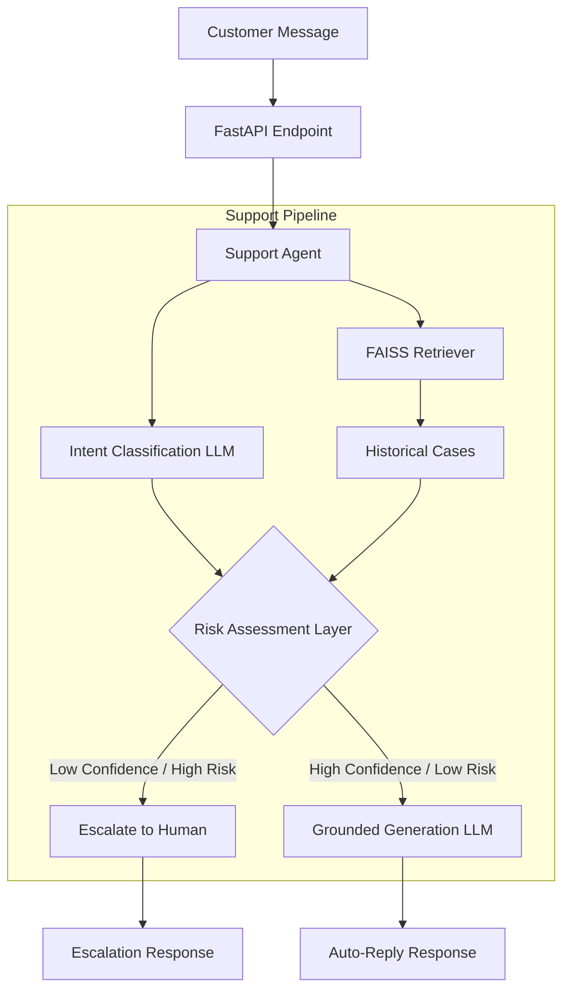

# System Architecture

## Overview
The system follows a Modular Monolith pattern built with Python and FastAPI. It relies on a local Vector Store (FAISS) for evidence retrieval and an LLM Provider Interface for inference.

## Data Flow Diagram

### 2. Knowledge Base (RAG)
- **Data Source**: Reconstructed two-turn conversations for `AppleSupport`.
- **Data Split**: The reconstructed conversations are shuffled and split into 95% Training (`train_conversations.json`) and 5% Testing (`test_conversations.json`).
- **Data Leakage Prevention**: The FAISS index ONLY loads the 95% Training set. The 150 Golden Evaluation items are sampled exclusively from the 5% Test set. This guarantees the agent never retrieves the exact case it is being evaluated on.
- **Index**: FAISS using `all-MiniLM-L6-v2` embeddings.
- **Retrieval**: Top-K nearest neighbors based on the customer's message.
- **LLM Provider**: Gemini 1.5 Flash (primary) with Groq/Qwen fallback.
- **Data Pipeline**: Pandas for dataset processing.
- **Testing & CI**: Pytest, GitHub Actions.

## Key Modules
- `src/api/main.py`: The entry point for the REST API.
- `src/services/agent.py`: The core orchestrator that enforces business rules (the Risk Assessment Layer).
- `src/services/retriever.py`: Abstracts FAISS indexing and vector search.
- `src/services/llm_provider.py`: Abstract interface allowing swapping between Gemini, Groq, or local models.
